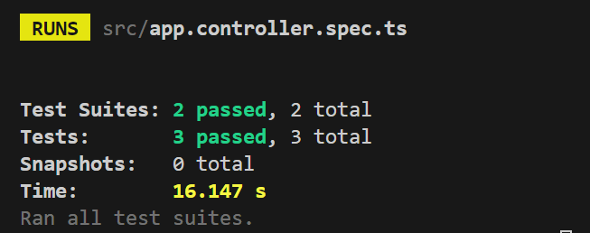
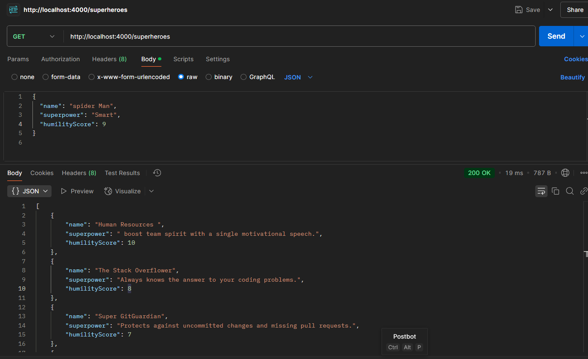
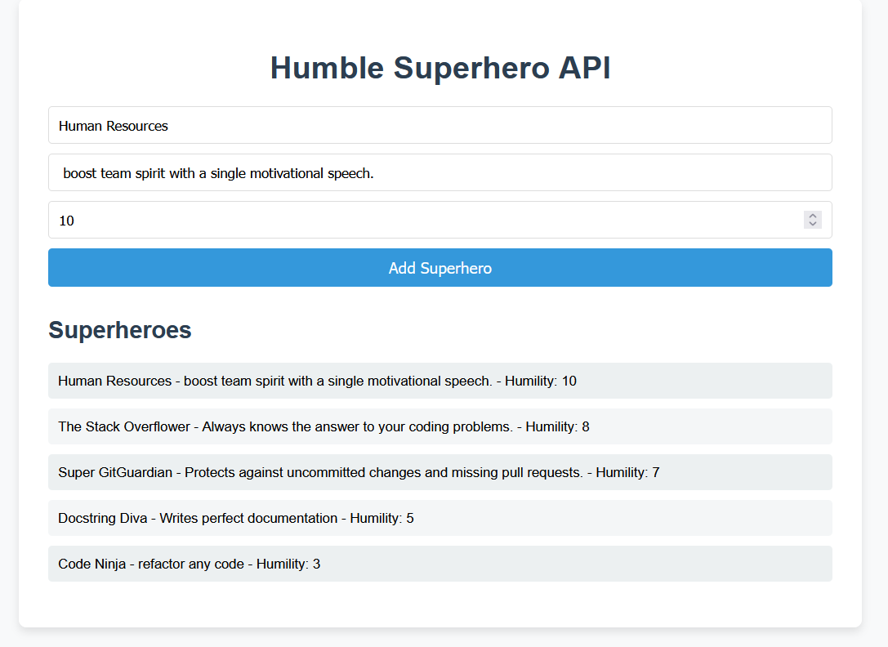

# Humble Superhero API 🌟🦸‍♂️

---

## 🚀 Features

- Add a new superhero with their name, superpower, and humility score (POST `/superheroes`).
- Fetch a sorted list of superheroes by their humility scores in descending order (GET `/superheroes`).
- Validation for humility score (must be a number between 1 and 10).
- (Optional) A React-based frontend to interact with the API in real-time.

---

## 🛠️ Technologies Used

- **Backend**: Node.js with [NestJS](https://nestjs.com/)  
- **Frontend** (optional): React with TailwindCSS  
- **Testing**: Jest for API endpoint testing  

---

## 🧪 Testing
Run the tests with:

    npm run test
Jest Test Coverage
Basic validation for POST /superheroes.
Ensures correct sorting for GET /superheroes.
[Be] 

---

## 📷 Screenshots
- Backend Running
[Be] 
- React Frontend
[fe] 

---

## 🧑‍🤝‍🧑 Collaboration Approach
If I were collaborating on this project:

- Code Reviews: I’d request frequent code reviews to ensure shared understanding of the task and gather feedback.
- Pair Programming: For key features like validation or sorting logic, I’d work with a teammate to brainstorm and implement.
- Task Breakdown: I’d divide work into clear, manageable tasks and assign based on each person’s strengths.
- Documentation: Clear commit messages, inline comments, and shared understanding of the README.

  ---
  
## 🌱 If I Had More Time
If I had more time, I’d explore the following:

- Database Integration: Replace the in-memory database with a persistent store like MongoDB or PostgreSQL.
- Authentication: Add user accounts and authentication for managing superheroes.
- Frontend Enhancements: Add search and filter capabilities, along with more detailed superhero profiles.
- Deployment: Deploy the app using services like Vercel for the frontend and AWS or Heroku for the backend.
- Advanced Testing: Write more comprehensive tests to cover edge cases and stress test the endpoints.

---

## 🤝 Acknowledgments
 Thank you for reviewing my submission! This project reflects my enthusiasm for solving problems, building solutions, and growing through collaboration. 
